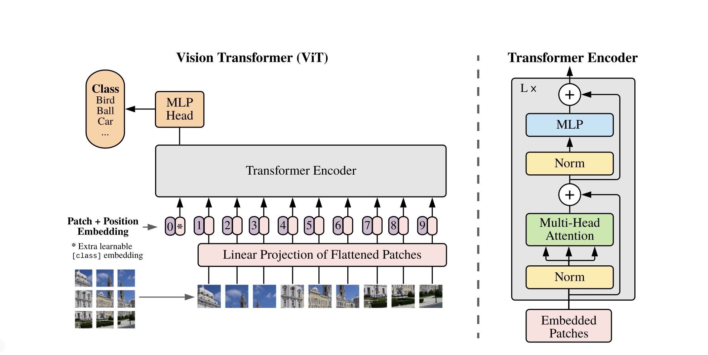
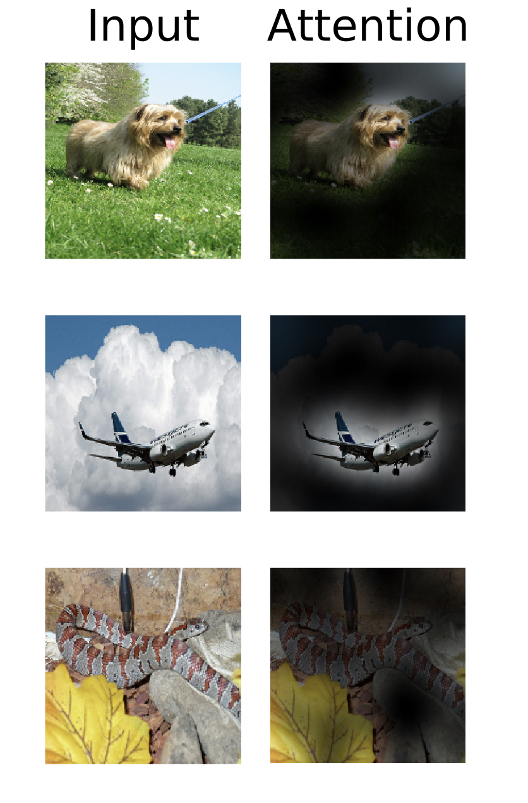

# Vision-Transformer-for-Galaxy-Classifier
Brown University Visual Computing Lab Starter Project

## Background and Motivation

Transformers have increasingly become the mainstream Natural Language Processing Model due to its advantages over CNN: 1. suitable for Parallel Processing with GPUs therefore faster training  2. More intuitive and better interpretability

With the 2021 paper AN IMAGE IS WORTH 16X16 WORDS: TRANSFORMERS FOR IMAGE RECOGNITION AT SCALE, visual transformers have been shown to perform better than state-of-the-art CNNs. In this project, I will implement the visual transformer model using Python Tensorflow framework and perform image classification on galaxy zoo image dataset. 

## Dataset
The dataset for this project is the Galaxy 10 dataset (see https://astronn.readthedocs.io/en/latest/galaxy10sdss.html) which contains 21785 images of size 69 x 69 taken from the SDSS (Sloan Digital Sky Survey). The images are classified manually by volunteers in a crowd source project and are divided into 10 classes: 

Class 0 (3461 images): Disk, Face-on, No Spiral

Class 1 (6997 images): Smooth, Completely round

Class 2 (6292 images): Smooth, in-between round

Class 3 (394 images): Smooth, Cigar shaped

Class 4 (1534 images): Disk, Edge-on, Rounded Bulge

Class 5 (17 images): Disk, Edge-on, Boxy Bulge

Class 6 (589 images): Disk, Edge-on, No Bulge

Class 7 (1121 images): Disk, Face-on, Tight Spiral

Class 8 (906 images): Disk, Face-on, Medium Spiral

Class 9 (519 images): Disk, Face-on, Loose Spiral

Galaxy10 is meant to be an alternative to MNIST or Cifar10 as a deep learning toy dataset for astronomers.

## Vision Transformer Model
The Vision Transformer model has a relatively simple model architecture that is built upon the original transformer model proposed in the Attention is All You Need Paper (Vaswani, 2017). It utilizes the traditional encoder-decoder architecture which consists of alternating block of Multi-headed attention and MLP, with layer normalization and skip connections in between each block. The input to the encoder is a customed layer of Patch Encoding (composition shown on the left). 

To build this patch encoding, we first extract non-overlapping patches from the original 2D images. Then we flatten the patches into 1D which now has the length of the total number of patches. Then we linearly project this 1D flattened patches into a lower dimensional space (projection dimension is smaller than the total number of patches). **We can intuitively understand this process as getting the resemblance of the basis functions of the fine structures in the patches.** Next, we create a learnable positional embedding layer that takes in the total number of patches in symbol representations and convert them into continuous representations of the projection dimension size. Lastly, we add the positional embedding layer with the linear projection layer.  **We can intuitively understand the process as learning the relative positions of the patches where closer patches have positional embeddings of higher cosine similarity and vice versa.**

The Attention Mechanism enables the vision transformer to globally pay attention to the object in the image that we need to classify, which explains its success in image classification task. 

But we see that CNNs could also highlight the object in the image to perform image classification task, just like vision transformers do? 

CNNs are great at feature extractions through different filters but it **does not encode the relative positon of different features**. With a fixed size filter it could only see that **there exists some features in the object but not how close these features are positional-wise.** And as humans we classify images through understanding the relative positions of various features in an object instead of whether there exists such features in an object. For example, A face should have two eyes next to each other and a nose in the middle, but simply having these organs in random postions would not constitute a face (and that would actually be really scary). 

Having filters of different scales and using large feature pyramid in CNN would help with this situation. However, that would drastically increase the computational resources required and would be time comsuimg to train.

## Credit goes to:
SDSS (Sloan Digital Sky Survey)
Alexey Dosovitskiy: author of vision transformer paper
Vaswani: Author of Transformer Paper

